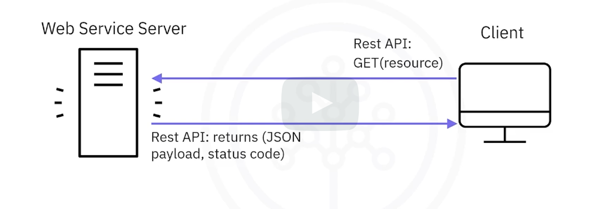
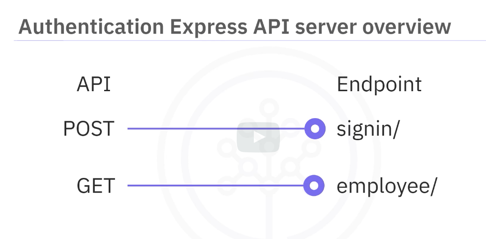
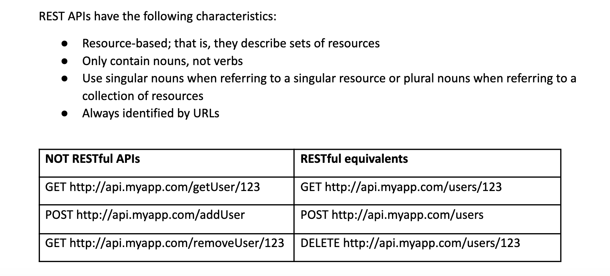
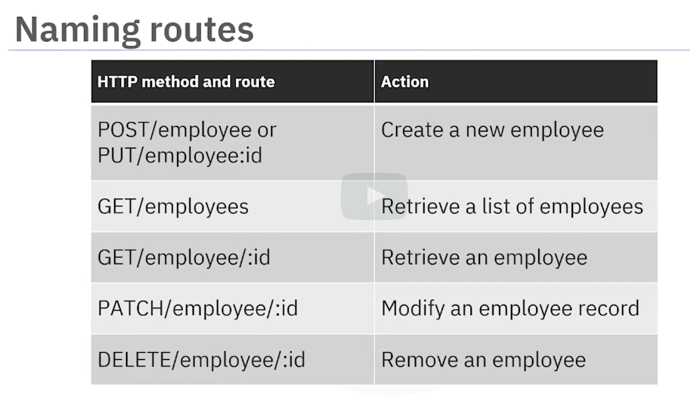
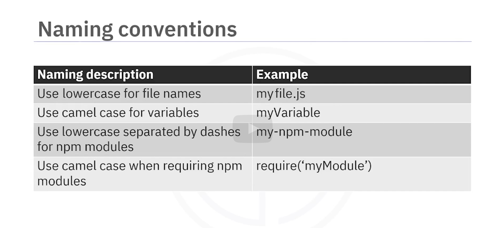

# extending Node.js
    - extend Node.js with third party packages
    - define package dependencies
The default Node.js rfmaweork has limited web dev potential
Node js relys on third-party packages to extend its functionality, Node.js doest not provide a parsing function for XML or JSON, it relies on third-party packages to do that

# intro to web frameworks
    - Differentiate between Node.js abd Node.js vased web fraeworks
    - Explaon MVC and Rest API architectural styles 
    - Descrive prominent features of serveral node web frmeworks
## runtime enviornments
- node js is not a web framework, its a runtime enviornment for executing javascript code
- web frameworks are skeletons on which aplicatiosn are built
- they are higher level abstractions that provide a set of tools and libraries to make web development easier
- Node.js requires a web framework to build web applications
## There are two approaches to building back ends
- Model-view-controller (MVC)
- Representational state transfer application programming interface (REST API)

### MVC
- divides the application into three interconnected parts
    - Model: the data layer of the application, interacts with databse and handles data logic
    - View: the presentation layer of the application, renders the presentation of the data
    - Controller: the logic layer of the application, regulates data flow, processes data provided by the user
- popular frameworks that use MVC
    - used for apps that need seperation of data from the data presentation and from the manipulation of data
    - KOA
    - Django
    - Express
    - NestJS
### REST API
- allow multiple web services to communicate each other and the client
- RESTful APIs
    - client and server communicate via HTTP requests
    - client does not kno the state of the server
    - server does not store client state
    - communicate via operations on resources
    - communication does not reply on an implementation of the API


## Express
- most popular Node.js web framework
- used for routing and middlware
- easy to implement an MVC architecture
- advantages
    - handles multiple operation requests concurrently
    - Has HTTP helpers for handling HTTP requests
    - Helps facilitate communication between client nd server
    - Efficiently provides HTTP header to URLS to get data requested by the client
## KOA
    - Designed by the team behind Express
    - More robust foundation for Web applications and APIs
    - uses async functions in a way that doesnt not require callbacks
    - increased error handling ability
    - Appropriate for applications that are:
        - data intensive
        - API centric
        - Single page applications
## socket.io
    - best for apps with reeal-time bidirectional data exchange between clients and servers
    - uses WebSocket rather than HTTP for communication
    - servers push data wihtout a request from the clinet
    - works well for applications such as
        - chat rooms
        - textin apps
        - multiplayer games
## hapi.js
    - open source
    - lots of built0in securoty
    - many plugins
## NestJS
    - large enterprise applications
    - multi-layered architecture
    - uses TypeScript
    - MVC architecture
    - uses Express

# Express Web Application Framworks
- descrive the Express framework
- explain the primary use of express
- download express
## two purposes of express
- as an API
    - setup an HTTP interface to interact with the data layer of the application
    - data is sent back to the client in JSON format using a response/res object
    - the res.json() method
        - notifies the clinet of the content type being sent
        - stringify data
- setup templates with server-side rendering (SSR)
    - used to create templates
    - data is sent from the client to the server
    - templats use the data to create HTML,CSS AND JAVA SCRIPT
    - Uses the res.render() method
        - renders the template
        - sends the rendered template to the client
- express implements an app class that you map to a web resource path
- the standard Node.js framework treats HTTP requests at a lower level
- the http.createServer function relies on a custom callback function to parse throuh a web resource path

## how express works
1. Declare Express as a depednency in the package.json file
    - create a package.json file in your project folder
    - the package.json file contains all the dependencies and scripts for the project
    - name, version, description, Main, Dependencies
    - to declare express as a dependency, list the express moduel and a version number in the dependencies property
    ```JSON
    {
        "name": "express",
        "version": "1.0.0",
        "description": "",
        "main": "index.js",
        "scripts": {
            "test": "echo \"Error: no test specified\" && exit 1"
        },
        "keywords": [],
        "author": "",
        "license": "ISC",
        "dependencies": {
            "express": "4.x"
        }
    }
    ```
2. Run the npm command to download any missing modules
3. Import the express module into the application
```JavaScript
let express = require('express')
let app = express()
```
4. create a new route handler
```JavaScript
app.get('/temperature/:location_code', (req, res) => { // listen to incoming GET request to the temperature resource path
    let location_code = req.params.location_code
    weather.current( location, function(error, temp_f)){ // run the weather.current function with a location parater taken from the resouece path
        ...
    }
})
```
5. Start an HTTP server on a given port number
```Javascript
let server = app.listen(port, function(){
    console.log('Server running at http://localhost:' + port + '/') // the app listesnt to incoming requests on port 8080
})
the second argument is a callback function that is executed when the server starts

```
# routing, Middleware and Templating
- explain routing in exrpress
- descrive middlware and how it is used
- explain template rendering in Express
## Routing
- routing is the process of mapping HTTP requests to content
- requests to different routes
    - Get
    - Post
    - Put
    - Delete
- app level and router level
```JavaScript
const express = require('express')
const app = new express()

app.get('/', (req, res) => {
    res.send('Hello World')
})
app.post('/', (req, res) => {
    res.send('Got a POST request')
})
app.put('/user', (req, res) => {
    res.send('Got a PUT request at /user')
})
app.delete('/user', (req, res) => {
    res.send('Got a DELETE request at /user')
})
```
- routers can be used to group route handlers for a particular part of an application together
```JavaScript
const express = require('express')
const app = new express()

let userRouter = express.Router()
let itemRouter = express.Router()

// routes for users
userRouter.get('/', (req, res) => {
    res.send('Hello World')
})
userRouter.post('/', (req, res) => {
    res.send('Got a POST request')
})
userRouter.put('/user', (req, res) => {
    res.send('Got a PUT request at /user')
})
userRouter.delete('/user', (req, res) => {
    res.send('Got a DELETE request at /user')
})
// routes for items
itemRouter.get('/', (req, res) => {
    res.send('Hello World')
})
itemRouter.post('/', (req, res) => {
    res.send('Got a POST request')
})
itemRouter.put('/user', (req, res) => {
    res.send('Got a PUT request at /user')
})
app.listen(8080, () => {
    console.log('Server running at http://localhost:8080/')
})
```
## Middleware
- functinos that runs between the time that he server gets the request and the time that the server sends the response
### the use() and next() methods
- app.use() is used to define middleware, thiese functions take three arguments
    - request object
    - response object
- next() function: this is used to call the next middleware function in the stack


- can be chained
- catergorized based on purpose use and soource
    - application level
    - router level
    - error handling
    - built-in
    - third-party
### application level middleware
- bound with app.use()
- useful for things like 
```javascript
const express = require('express')
const app = new express()

app.use((req, res, next) => {
    console.log('Time: ', Date.now())
    next()
})
```
### router level middleware
- bound with router.use()
```javascript
const express = require('express')
const app = new express()

let userRouter = express.Router()
let itemRouter = express.Router()

userRouter.use((req, res, next) => {
    console.log('Time: ', Date.now())
    next()
})

userRouter.get('/', (req, res) => {
    res.send('Hello World')
})
app.use('/user', userRouter)
```
### error handling middleware
- bound with app.use() or router.use()
```javascript
const express = require('express')
const app = new express()
app.use("/user/:if", (req, res, next) => {
    if (req.params.id === "0") next("route") // is the user id one is accessed then an error is thrown
\    else next()
})
app.use("user", (err, req, res, next) => { // takes 4 args
    if (err) console.log(err)
    else next()
})

```
### built-in middleware
- static files, cookie parser, JSON, urlencoded
```javascript
// exmpale of static middleware used to render static files
const express = require('express')
const app = new express()
app.use(express.static('cad220_staticfiles')) // static files can be rendered from this directory
app.listen(3333, () => {
    console.log('Server running at http://localhost:3333/')
})
```

### third-party middleware
- open source packages

### template rendering
```javascript
const express = require('express')
const app = new express()
const expressReactViews = require('express-react-views')

const jsxEngine = expressReactViews.createEngine()

app.set('view engine', 'jsx')

app.set('views', 'mmyviews')

app.engine('jsx', jsxEngine)

app.get('/', (req, res) => {
    res.render('index', {name: 'John Doe'})
})
```

# Authenrication and Authorization
- discuss advantages of token - based authentication in Node.js
- implement tokn based authentication and authorization in Node.js
## session based authentication
## token based authentication
- session based authentication is the traditional approach to authentication
- these are the advantages
    - more scalable
    - Flexible
    - Secure
## passwordless authentication
## Authenticatio Express PI server overwiew

this is what the code would look like
```javascript
const express = require('express')
const myapp = express()
// creates a webservice that listens to the /login resource path
myapp.get("/employees", (req, res) => {
    // creates a get request to the /employees resource path
    return res
        //any request returns a 401 status code
        .status(401)
        .json({message: "please login first"})
})
myapp.listen(5000, () => {// starts the server on port 5000
    console.log("API server is localhost:5000")
})
```

to execute the API save the file and name it apiServer.js

```bash
node apiServer.js
```

to verify that you cant access
```bash
curl -i http://localhost:5000/employees
```
the output should be
```bash
"please login first"
```
## JWT
generate JWTs with jsonwebtoken npm package
```bash
npm install -save jsonwebtoken
```
require tge module
```javascript
const express = require('express')
const jsonwebtoken = require('jsonwebtoken')
const JWT_SECRET = "mysecret"
const myapp = express()

myapp.use(express.json()) // this is middlware that parses incoming request bodies with JSON payloads makes it available on req.body
myapp.post("/signin", (rew, res) => {
    const {uname, pwd} = req.body // get the username and password from the request body
   if (uname == 'user' && pwd == 'password') {
       return res.json({
           token: jsonwebtoken.sign({uname: uname}, JWT_SECRET)
       })
   }
    return res.status(401).json({message: "invalid credentials"})
})
myapp.get("/employees", (req, res) => {
    let token = req.headers('Authorization') // get the token from the request header
    if (!token) {
        return res.status(401).send({message: "no token provided"})
    }
    if (tkn.startsWith('Bearer ')) {
        token = token.slice(7, token.length).trimLeft()
    }
const decoded = jsonwebtoken.verify(token, JWT_SECRET) // verify the token
if (!decoded) {
    return res.status(401).send({message: "invalid token"})
}
return res.json({message: "success"})
})
myapp.listen(5000, () => {
    console.log("API server is localhost:5000")
})

```
## HTTP Methods and REST API
- define terms related to HTTP methods
- explain guidlines abd best practices for writing REST APIs
- REST stands for REpresetnational State Transfer
- REST is an architectural style for building APIs
- in a client/server architectire, the applications are copmosed of one or more services that reside onthe servers , thse services contain resources. The client makes a request fot a resource and the server responds with the resource

<iframe src="./images/API.pdf" width="100%" height="500px"></iframe>

### status code range
- 200 - 299: success
- 300 - 399: resource has moved
- 400 - 499: client error

## REST guidlines
1. the API leverages a client server architecture made up of resources that are managed and delivered via http
2. communication between client and server is stateless
3. data is xacheable to improve performance
4. the interface is transferred in a standard format such tha the reqiuested resources stored on the server are seperated from the representation sent to the client. The representation sent to the client contains sufficient data so that the client can manipulate the representation
5. requests and response communicate through different layers, like middleware, The client and server often do not communicate directly with each other
6. (optional) resources are usually static but ca slo contain executable code. The code should only be executed by the client if it is trusted


## example
```javascript
const express = require('express');
const routes = require('./routes/users.js');

const app = express();
const PORT =5000;

app.use(express.json()); // handles the request as a json onject

app.use("/user", routes); // uses routes to handle the endpoints which start with /user 
// this means that for all the endpoints starting with /user the server will go and look for an endpoint handler in users,js

app.listen(PORT,()=>console.log("Server is running at port "+PORT));

```
this is how it would look like with authentication
```javascript
const express = require('express');
const routes = require('./routes/users.js');
const jwt = require('jsonwebtoken');
const session = require('express-session')

const app = express();
const PORT =5000;

app.use(session({secret:"fingerpint",resave: true, saveUninitialized: true}))

app.use(express.json());

app.use("/user", (req,res,next)=>{
// Middleware which tells that the user is authenticated or not
   
   if(req.session.authorization) {
       let token = req.session.authorization['accessToken']; // Access Token
       
       jwt.verify(token, "access",(err,user)=>{
           if(!err){
               req.user = user;
               next();
           }
           else{
               return res.status(403).json({message: "User not authenticated"})
           }
        });
    } else {
        return res.status(403).json({message: "User not logged in"})
    }
});

app.use("/user", routes);

app.post("/login", (req,res) => {
    const user = req.body.user;
    if (!user) {
        return res.status(404).json({message: "Body Empty"});
    }
    let accessToken = jwt.sign({
        data: user
      }, 'access', { expiresIn: 60 * 60 });

      req.session.authorization = {
        accessToken
    }
    return res.status(200).send("User successfully logged in");
});

app.listen(PORT,()=>console.log("Server is running at port "+PORT));
```
## users.js
```javascript
const express = require("express");
const router = express.Router();

let users = [
  {
    firstName: "John",
    lastName: "wick",
    email: "johnwick@gamil.com",
    DOB: "22-01-1990",
  },
  {
    firstName: "John",
    lastName: "smith",
    email: "johnsmith@gamil.com",
    DOB: "21-07-1983",
  },
  {
    firstName: "Joyal",
    lastName: "white",
    email: "joyalwhite@gamil.com",
    DOB: "21-03-1989",
  },
];

// GET request: Retrieve all users
router.get("/", (req, res) => {
  // Copy the code here
  res.send(users); //This line is to be replaced with actual return value
});

// GET by specific ID request: Retrieve a single user with email ID
router.get("/:email", (req, res) => {
  // Copy the code here
  const email = req.params.email;
  let filtered = users.filter((user) => user.email == email);
  res.send(filtered); //This line is to be replaced with actual return value
});

// POST request: Create a new user

router.post("/", (req, res) => {
  users.push({
    firstName: req.query.firstName,
    lastName: req.query.lastName,
    email: req.query.email,
    DOB: req.query.DOB,
  });
  res.send("The user" + " " + req.query.firstName + " Has been added!");
});

// PUT request: Update the details of a user by email ID
router.put("/:email", (req, res) => {
  const email = req.params.email;
  let filtered_users = users.filter((user) => user.email === email);
  if (filtered_users.length > 0) {
    let filtered_user = filtered_users[0];
    let DOB = req.query.DOB;
    //if the DOB has changed
    if (DOB) {
      filtered_user.DOB = DOB;
    }
    /*
      Include code here similar to the one above for other attibutes
      */
    users = users.filter((user) => user.email != email);
    users.push(filtered_user);
    res.send(`User with the email  ${email} updated.`);
  } else {
    res.send("Unable to find user!");
  }
});

// DELETE request: Delete a user by email ID
router.delete("/:email", (req, res) => {
  const email = req.params.email;
  users = users.filter((user) => user.email != email);
  res.send(`User with the email  ${email} deleted.`);
});

module.exports = router;
```
### how to store user-specific data ni a session
```javascript
// Assuming express-session is installed and configured
const session = require('express-session');

app.use(session({
  secret: 'fingerpint',
  resave: false,
  saveUninitialized: true
}));

app.get('/set-session', (req, res) => {
  req.session.username = 'john_doe'; // Store user-specific information in the session
  res.send('Session set');
});

app.get('/get-session', (req, res) => {
  const username = req.session.username; // Access stored information from the session
  res.send(`Username: ${username}`);
});

```
# expres best practices
- descrivefolder structure for building an express app
- identify best practices for building an express app
## web framework structurea
express does not require a specific folder structure
it is suffested to go as follows
- node_modules
    - contains applications modules and packages
    - automatically created when you run npm install
- config
    - contains configuration files
        -db connection
        - environment variables
        - credental filesfor apis
    - can be used to store environment variables
- models
    - contains the data models
    - can be used to store the data models using an object relational mapping (ORM) library
- routes
    - specifies all the routes for all entites
    - one file per each logical entity
- views
    - contains the templates
    - templates dynaimcally write HTML, CSS and JavaScript
- public
    - contains all static content like images, css and javascript
- app.js    
    - the app.js is the main config
- routes.js
    - central location to access all the routes
    - imports all files from routes from routes folder
    - exports them as a single module to app.js
- package.json
    - contains metadata used to manage the project

## using Node Package Manager (npm)
- use npm init when intializing
- use --save to save the dependencies
- the --save-dev flag is used to save the dependencies as dev dependencies
- never push a node_modules folder to a git repo
- always use a .gitignore file to ignore the node_modules folder
## naming conventions 
